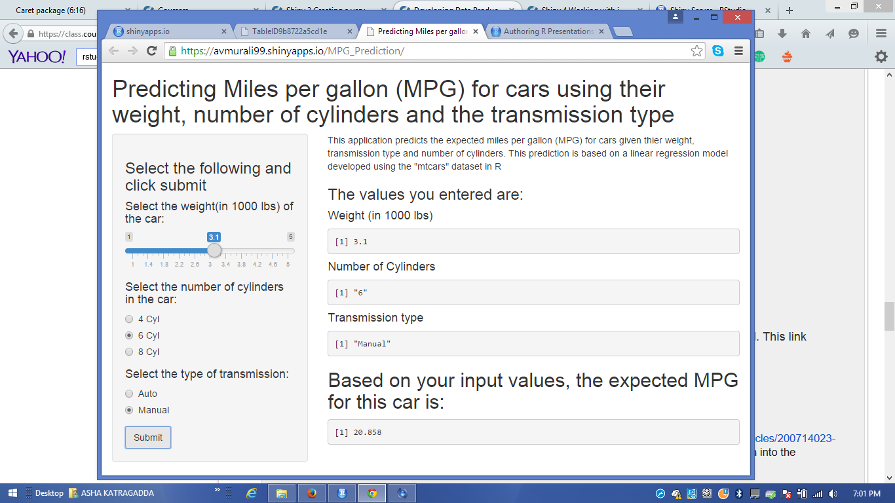

Predicting Miles per Gallon for cars
========================================================
author: Murali Alam
date: Feb 22,2015
transition: fade
font-family: 'Helvetica'

Introduction
========================================================
type: section
This application predicts the expected Miles per Gallon (MPG) for               cars given the following values: 
              
- Weight of the car (in 1000 lbs)
- Number of Cylinders (4 or 6 or 8)
- Transmission type (Auto or Manual)

This prediction is based on a linear regression model developed
using the "mtcars" dataset in R.

Linear coefficients
========================================================
type: section

```r
data(mtcars)
modFit <- lm(mpg~ wt + cyl + am, data = mtcars)
summary(modFit)$coef[,1]
```

```
(Intercept)          wt         cyl          am 
 39.4179334  -3.1251422  -1.5102457   0.1764932 
```

We will use these coefficients and build our linear equation to predict the expected MPG for cars given the predictor values

Building Shiny App
========================================================
type: section
- <small>A simple shiny app is built that takes the input values for Weight of the car (in 1000 lbs), Number of Cylinders (4 or 6 or 8) and Transmission type (0 forAuto  and 1 for Manual).</small>
- <small>Then on the server side, we calculate the MPG value using the values entered and the coefficients calculated previously.</small>
- <small>Say the user enters 2.3 for weight, 4 for number of cylinders and transmission type as manual, then here is how the mpg is calculated:</small>

```r
mpg <- (39.42-(3.12*2.3)+(0.17*1)-(1.51*4))
mpg
```

```
[1] 26.374
```
Shiny App image
========================================================
<small> Here is how the App looks in the browser</small>

